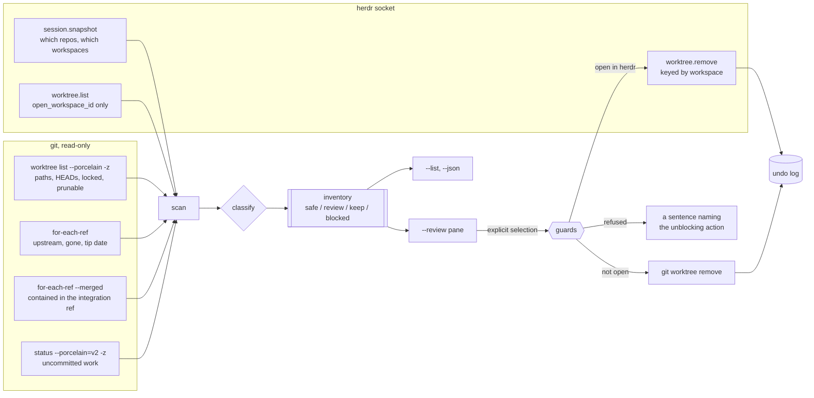

# shear

A worktree janitor for [herdr](https://github.com/moneycaringcoder/herdr).

Long-lived agent sessions leave git worktrees behind: one per branch, per
experiment, per abandoned idea. Most of them are dead and a few of them are not,
and telling the two apart by hand is tedious enough that nobody does it until
the disk fills up.

`shear` enumerates every worktree the session knows about, says how dead each
one looks and what it costs in disk, and removes the ones you pick — never the
ones you did not.

```
$ shear --list

  verdict classes          age   disk branch     path

repo repo  /tmp/shear-demo/repo
  safe    gone,merged      <1h 8.0 kB landed     /tmp/shear-demo/wt-landed
  review  merged             - 8.0 kB (detached) /tmp/shear-demo/wt-detached
  review  stale             2y 8.0 kB forgotten  /tmp/shear-demo/wt-forgotten
  review  dirty,merged     <1h 3.9 MB messy      /tmp/shear-demo/wt-messy
  review  merged           <1h 8.0 kB reviewed   /tmp/shear-demo/wt-reviewed
  review  prunable,merged  <1h      - vanished   /tmp/shear-demo/wt-vanished
  keep                     <1h 8.0 kB inflight   /tmp/shear-demo/wt-inflight
  blocked merged           <1h 456 kB main       /tmp/shear-demo/repo
  blocked locked,merged    <1h 8.0 kB pinned     /tmp/shear-demo/wt-pinned

9 worktrees in 1 repository: 1 safe worktree, 5 review, 1 keep, 2 blocked.
Removing the 1 safe worktree would reclaim 8.0 kB of the 4.4 MB all 9 worktrees occupy.
Removing a worktree leaves its branch and every commit on it intact: only the checkout
goes.
```

That is a real run against a real repository built to contain one worktree of
every class, not a mock-up. One of nine is `safe`; the other eight each have a
reason not to be, and the reason is on the row.

Nine worktrees is a small session. The number that makes this worth running is
what forty look like.

## What it does

Six verbs. Only two of them can remove anything, and neither does so without an
explicit selection:

| Verb | What it does |
| --- | --- |
| `shear --list` | Prints the inventory and exits. The default, and a dry run by construction. |
| `shear --json` | The same inventory, machine-readable. |
| `shear --report` | CI-shaped stale worktrees by repository, with no path to removal code. |
| `shear --review` | Interactive review pane: select, confirm, remove. |
| `shear --remove <PATH>` | Removes one named worktree, subject to every guard below. |
| `shear --restore <id>` | Restores the checkout named by a `#N` from `--undo-log`. It returns on its branch only if that branch still points at the recorded commit; otherwise it returns detached at that commit, without creating or moving a branch. |
| `shear --undo-log` | Every removal shear successfully recorded, newest first, with the command that restores it. |

Shear attempts to append the undo record before removing a checkout. If the
state directory is unwritable, an explicitly confirmed removal still proceeds,
but shear warns before the attempt and keeps the full restore command visible.
The review pane preserves that warning through later actions, route failures,
redraws, and pane exit. The undo log therefore does not claim to contain a
removal whose record could not be written.

The scan is read-only git plumbing (`worktree list`, `status --porcelain=v2`,
`for-each-ref`) plus Herdr queries for the session's workspaces and panes and
each repository's `open_workspace_id` values. A hand-run standalone scan (no
`HERDR_PLUGIN_ID` and no non-empty `HERDR_SOCKET_PATH`) keeps the existing
git-only safety rule when Herdr is absent. Either marker means Herdr context is
expected. Once Herdr is expected, or the socket has answered, visibility must be
complete before a row can be `safe`: a failed connection or `session.snapshot`
demotes all affected rows, while a failed `worktree.list` demotes only that
repository. Herdr's `not_git_worktree` answer is data, not a failed join. The
on-screen note names actual missing visibility. These rows stay `review`, not
`blocked`, so explicit selection and removal remain available; only bulk
preselection is withheld.



Two things about that diagram are worth stating out loud, because both invert
the obvious assumption and both were established by probing a live herdr rather
than by reading documentation:

- **git is the authority, not herdr.** herdr's `worktree.list` reports no lock
  flag at all, gives every row the *repository* name as its label, and drops
  git's reason for a prunable worktree. It is called for exactly one field,
  `open_workspace_id`.
- **`worktree.remove` is keyed by workspace, not by path**, so herdr can only
  remove a worktree it has open — which is the minority. The worktrees that pile
  up are precisely the ones nobody has open, and those go through
  `git worktree remove`.

See [docs/herdr-protocol.md](docs/herdr-protocol.md) and
[docs/git-plumbing.md](docs/git-plumbing.md) for what was verified and how.

## Classification

Every worktree carries a set of **classes** — the reasons it looks dead — and
exactly one **verdict**, which is what shear is willing to do with it.

### Classes

| Class | Meaning |
| --- | --- |
| `protected` | The absolute checkout path or branch matched a configured `protect` pattern. Never removable while that pattern remains. |
| `dirty` | Uncommitted changes: staged, unstaged, untracked or unmerged. Overrides everything for safety. |
| `locked` | `git worktree lock` was used on it. Somebody's explicit "do not touch this". |
| `open` | A herdr workspace currently holds this checkout open. |
| `occupied` | A herdr pane's working directory is inside this checkout — a pane that removing the checkout would not close. The row names the pane. |
| `prunable` | git reports the checkout directory is gone but its admin entry survives. |
| `gone` | The branch tracks a remote ref that no longer exists (`%(upstream:track)` says `[gone]`). |
| `merged` | The branch tip is contained in the integration ref. |
| `stale` | The branch tip is older than the staleness threshold (default 14 days). |
| `merged?` | The merge question **could not be asked** — no integration ref resolved, or there is no commit to test. Not the same as "not merged". |

`merged?` is a rendering of `Merged::Unknown`, and it is deliberately its own
token rather than the absence of `merged`. "I asked and the answer is no" and "I
could not ask" are different facts; a repository with no resolvable default
branch would otherwise report every worktree as unmerged. Nothing carrying
`merged?` is ever called safe.

### Verdicts

| Verdict | Meaning |
| --- | --- |
| `safe` | Clean, merged into the integration ref, upstream gone, not protected, not locked, not open in herdr, not the main checkout, and backed by complete Herdr workspace/pane visibility or a genuine standalone scan. The **only** verdict a bulk action may preselect. |
| `review` | Some evidence of death, but not all of it. Removable, never preselected. |
| `keep` | Nothing suggests this is dead. Removable only by explicit selection. |
| `blocked` | Cannot be removed as things stand — protected, locked, open in herdr, occupied by a pane, or the main checkout. The row names the unblocking action. |

Every condition in `safe` must be a *positive* observation. An unanswerable
question fails the test rather than passing it. Incomplete Herdr visibility is
knowledge missing from the safety proof, not a removal blocker: a dying row is
`review` and remains explicitly selectable.



The shape of that picture is the point. A single blocker short-circuits the
whole decision, while `safe` needs every question answered — and answered
*positively*, which is why a repository with no resolvable default branch has no
safe worktrees at all rather than a listing full of them.

## Safety rules

1. **The main checkout is never removable.** There is no override.
2. **A protected worktree is never removable.** Its row names the matching
   `protect` pattern; edit or remove that pattern from `config.json` to unblock
   it. No flag or permission overrides protection.
3. **A locked worktree is never removable.** Unlock it yourself with
   `git worktree unlock`; shear will not do it on your behalf.
4. **A worktree open in a herdr workspace** is removable only when you have
   explicitly permitted closing that workspace, and then only through herdr's
   `worktree.remove`, which closes the workspace as part of the removal. The
   review pane never does this — it shows you which workspace to close.
5. **A worktree a herdr pane is sitting in is never removable** while the pane
   is there, excepting the panes of a workspace holding the checkout open —
   herdr's `worktree.remove` closes those with it. A pane from anywhere else
   would be left standing in a directory that no longer exists, so no flag
   overrides this; close the pane, or move it elsewhere, and run shear again.
   Occupancy is a herdr fact: with no reachable socket shear cannot see panes,
   just as it cannot see workspaces, and the scan's notes say so.
6. **A dirty worktree** is removable only with `--force-dirty`, which itself
   requires `--i-understand-<N>-files` naming the exact at-risk count. In the
   review pane, you type that number. A confirmation that can be given without
   reading the number is not a confirmation.
7. **Never `rm -rf`.** Removal is `git worktree remove`, or herdr's
   `worktree.remove` for a checkout herdr holds open. Both leave the branch and
   every commit on it in place.
8. **Every removal is logged before it is attempted**, with the HEAD oid and the
   command that puts the checkout back, so a removal that half-succeeds is still
   recoverable.

Nothing is ever removed without an explicit selection. `--list` and `--json`
have no path to the removal code at all.

A refusal names the number you would have to acknowledge, so you cannot give the
confirmation without having read it:

```
$ shear --remove /tmp/shear-demo/wt-messy
shear: refusing /tmp/shear-demo/wt-messy: the worktree has 202 uncommitted files at
risk. Pass --force-dirty together with --i-understand-202-files to remove it anyway
shear: 1 of 1 selected worktree refused; nothing was removed
```

One refusal in a batch stops the whole batch, rather than leaving you to work
out which half ran. And a removal tells you how to undo it, at the moment it
happens:

```
$ shear --remove /tmp/shear-demo/wt-landed
shear: removing 1 worktree:
  /tmp/shear-demo/wt-landed [landed] via git
removed /tmp/shear-demo/wt-landed
  restore with: git -C /tmp/shear-demo/repo worktree add /tmp/shear-demo/wt-landed landed

$ git -C /tmp/shear-demo/repo rev-parse --short landed
4280ea5
```

The branch is still there. That is the whole point, and both of those blocks are
copied from a real terminal.

## Install

As a herdr plugin:

```
herdr plugin install moneycaringcoder/herdr-shear
```

For local development, which links the checkout without running the build step:

```
herdr plugin link /path/to/herdr-shear
cargo build --release --locked
```

Or standalone, with no herdr at all:

```
cargo install --path .
shear --repo /path/to/repo --list
```

Requires herdr 0.8.0 or newer for the workspace half; linux and macOS.

## Usage

```
shear                          # the inventory, as a dry run
shear --review                 # the interactive pane
shear --repo ~/src/app --list  # one repository, no session needed
shear --repo ~/src/app --report # CI-shaped stale report, no removal path
shear --stale-days 30          # a slower definition of stale
shear --integration-ref origin/trunk
shear --no-size                # skip disk measurement entirely
shear --remove ~/src/app-wt/old-branch
shear --restore 3
shear --undo-log
```

The installed plugin's front door is the `open-review` action. A herdr
keybinding can open the overlay directly with:

```toml
type = "plugin_action"
command = "moneycaringcoder.shear.open-review"
```


### In the review pane

The pane is a ratatui view that inherits the terminal theme rather than
painting ordinary text with a fixed foreground. Verdict tags are green,
yellow, cyan, and red; the cursor reverses the whole row; selected worktrees
carry filled `[x]` checkboxes; and both confirmations appear as bordered
modals over the inventory.


```
  ↑ / k        previous row
  ↓ / j        next row
  mouse wheel  previous / next row
  left click   move the cursor (never toggle selection)
  space        toggle the row under the cursor
  a            select every `safe` row, and nothing else
  n            clear the selection
  r            remove the selection, after confirming
  R            rescan: re-read git and herdr without touching anything
  q / Esc      quit without removing anything
```

`a` *replaces* the selection with exactly the safe rows, so it can never leave
something unsafe selected by accident. A `blocked` row — the main checkout
included — cannot be selected at all; the refusal names the unblocking action.

A clean selection is confirmed once, by count and by bytes. A selection that
contains anything dirty gets a second, differently worded confirmation that
names the exact number of at-risk files and requires you to type that number.
Before either question appears, `r` re-reads git and herdr, carries the explicit
selection forward by exact path, and computes the question from those fresh
rows. Anything that vanished or became blocked drops out; if the refresh fails,
the old inventory and selection remain available and nothing is removed. Input
typed while the refresh is running is discarded rather than applied to the
question that follows.

`R` re-reads the world without touching it — after a fetch, a merge, or a
branch deletion somewhere else — and likewise carries the selection by path.

## Configuration

`~/.config/herdr/plugins/config/moneycaringcoder.shear/config.json`, every key
optional:

```json
{
  "integration_ref": "origin/main",
  "stale_days": 14,
  "stale_rules": [
    {"when": "merged", "days": 30},
    {"when": "unmerged", "days": 90}
  ],
  "protect": ["release-*", "/home/you/src/shared/**"],
  "git_timeout_seconds": 10,
  "measure_disk": true,
  "extra_repos": ["/home/you/src/other-repo"]
}
```

`stale_rules` are tried in order; the first matching `any`, `merged`,
`unmerged`, or `gone` rule supplies that worktree's threshold. `stale_days`
remains the fallback when no rule matches. A merge question that could not be
asked matches only `any`, never `merged` or `unmerged`.

`protect` patterns are matched against both the absolute checkout path and the
branch name. `*` matches within one path segment (or anywhere in a branch name);
`**` can also cross `/`. Nothing else has shell or regex meaning. A matching row
stays visible but is blocked, names the matching pattern, and cannot be removed
by any flag.

The undo log lives at
`~/.local/state/herdr/plugins/moneycaringcoder.shear/removed.jsonl`.

## Design decisions

### The review surface is an overlay pane, not a popup

The pane is a *working surface*. You scan forty rows, build up a selection over
a minute or two, and only then confirm something destructive. A popup is
dismissed by a stray key — and losing a selection to a mis-key is worse than
having to press `q` on purpose. An overlay pane survives the mis-key, keeps its
own scrollback, and sits alongside the rest of the session rather than on top of
it.

The same reasoning drives the terminal discipline: raw mode is entered exactly
once and restored from `Drop`, from a panic hook, and from SIGINT/SIGTERM. A
janitor that leaves somebody's pane in raw mode has done more damage than the
worktrees it removed.

### shear never deletes branches, only checkouts

Removing a worktree leaves its branch and every commit on it intact. That is not
a caveat, it is the whole reason this is a tool you can let loose on a session:
the worst case for a wrong pick is `git worktree add` and a few seconds of
disk I/O, not lost work. The sentence is printed under every table and kept on
screen in the review pane while you are deciding, because an action feels safe
only if you can see *why* it is safe at the moment you take it.

Consequently there is no `--delete-branch`, no `--prune-all`, and no bulk mode
that removes without a selection. A tool that also deleted branches would need a
different name and a much less cheerful README.

### Disk savings are shown twice, and never rounded up

Per row, because that is what justifies removing a *particular* worktree; and as
a total, because that is what makes anyone bother running a janitor in the first
place. Sizes are the space actually occupied on disk (`st_blocks * 512`, what
`du` reports), with hardlinks counted once and symlinks never followed.

Five things a size column must not do, and does not:

- A **failed** measurement renders `?`, never a plausible `0 B`.
- A **pending** measurement renders a dot leader, because the pane draws before
  the walk finishes and a zero that later becomes 1.2 GB is a lie with a delay.
- A **skipped** measurement renders `-`: `--no-size` requested no walk, so
  nothing is pending and no byte total is implied.
- A **missing** checkout also renders `-`: a prunable worktree reclaims nothing.
  It remains distinct from skipped sizing in machine output.
- A **provisional** figure — last run's measurement, drawn on the first frame
  while the walk re-measures — renders `~1.2 GB`, counts in no total, and is
  replaced by the walk. It is a claim about last time, never presented as a
  measurement.

Totals only add up rows that were actually measured, and the summary says how
many pending, provisional, or failed rows were not — "2 worktrees are not
measured, so that figure is a floor, not an estimate" — rather than quietly
undercounting. Deliberately skipped rows instead suppress the disk total: no
`0 B` value or floor is claimed. Byte figures are truncated rather than rounded,
so the number never overstates what you get back.

Machine output keeps the distinction explicit. Inventory JSON uses
`bytes: null` and `size_state: "skipped"` for `--no-size`. Report schema 2 adds a
`size_state` to each stale row and `total_skipped`/`reclaimable_skipped` counts
per repository; skipped rows do not inflate its unmeasured counts.

Last run's figures live in `sizes.jsonl` next to the undo log; deleting that
file costs nothing but one run's provisional figures.

### The table is sized from its content, and never overflows

Columns are computed from what is actually in them, so a session of short paths
does not get a table laid out for long ones. When the pane is too narrow to hold
everything, whole columns are dropped in reverse order of how much they justify
a decision — branch, then classes, then age, then disk — rather than every
column being squeezed until none of them can be read. Paths truncate from the
**left**, because the tail is the informative half; branches and labels truncate
from the right.

No line is ever wider than the width it was given, at any width down to 40
columns. That is not an aspiration; `tests/render.rs` asserts it at every width
from 40 to 200.

## Development

```
cargo build --locked
cargo test --locked
cargo clippy --all-targets --locked -- -D warnings
cargo fmt --all -- --check
```

`tests/render.rs` and `tests/tui.rs` build their inventories by hand and need
neither a repository nor a running herdr, so the rendering and the whole review
state machine — including both confirmations for a dirty removal — are testable
without a terminal. The other suites use real repositories built by
`tests/fixtures.rs`.

## Licence

MIT. See [LICENSE](LICENSE).
